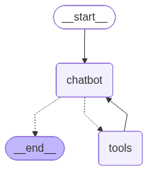

### And welcome to Week 4, Day 3 - more LangGraph..


```python
from typing import Annotated
from langgraph.graph import StateGraph, START
from langgraph.graph.message import add_messages
from dotenv import load_dotenv
from IPython.display import Image, display
import gradio as gr
# NOTE: TooNode is to define the tools needed 
from langgraph.prebuilt import ToolNode, tools_condition
import requests
import os
from langchain_openai import ChatOpenAI
from typing import TypedDict

```


```python
# Our favorite first step! Crew was doing this for us, by the way.
load_dotenv(override=True)

```


    True


### First, let's go set up LangSmith!

https://langsmith.com

### Next, here is a useful function in LangChain community:


```python
from langchain_community.utilities import GoogleSerperAPIWrapper

serper = GoogleSerperAPIWrapper()
serper.run("What is the capital of France?")
```


    'Paris is the capital and largest city of France, with an estimated population of 2,048,472 in January 2025 in an area of more than 105 km2 (41 sq mi). Paris is the capital and most populous city of France. Situated on the Seine River, in the north of the country, it is in the centre of the Île-de-France ... Paris is the capital of France, the largest country of Europe with 550 000 km2 (65 millions inhabitants). Paris has 2.234 million inhabitants end 2011. The capital of France has been Paris since its liberation in 1944. Paris, city and capital of France, located along the Seine River, in the north-central part of the country. Paris is one of the world\'s most ... Paris is the city of romance par excellence, the fashion capital and the best example of French art de vivre. Exploring Paris is an essential rite of passage ... Paris, the capital of France, is often referred to as the "City of Light" and is renowned for its art, culture, and history. It is home to ... Paris Capital City Of France In 4K Ultra HD Video | Paris, France Capital And Largest City | Paris Is A Major European City And A Global ... Paris became capital of France because France evolved from a federation of counties to a kingdom, where the king was living a Paris. The ... The capital and by far the most important city of France is Paris, one of the world\'s preeminent cultural and commercial centres.'


### Now here is a LangChain wrapper class for converting functions into Tools


```python
from langchain.agents import Tool

tool_search =Tool(
        name="search",
        func=serper.run,
        description="Useful for when you need more information from an online search"
    )


```

### Now we can try out the tool the langchain way


```python
tool_search.invoke("What is the capital of France?")
```


    'Paris is the capital and largest city of France, with an estimated population of 2,048,472 in January 2025 in an area of more than 105 km2 (41 sq mi). Paris is the capital and most populous city of France. Situated on the Seine River, in the north of the country, it is in the centre of the Île-de-France ... Paris is the capital of France, the largest country of Europe with 550 000 km2 (65 millions inhabitants). Paris has 2.234 million inhabitants end 2011. The capital of France has been Paris since its liberation in 1944. Paris, city and capital of France, located along the Seine River, in the north-central part of the country. Paris is one of the world\'s most ... Paris is the city of romance par excellence, the fashion capital and the best example of French art de vivre. Exploring Paris is an essential rite of passage ... Paris, the capital of France, is often referred to as the "City of Light" and is renowned for its art, culture, and history. It is home to ... Paris Capital City Of France In 4K Ultra HD Video | Paris, France Capital And Largest City | Paris Is A Major European City And A Global ... Paris became capital of France because France evolved from a federation of counties to a kingdom, where the king was living a Paris. The ... The capital and by far the most important city of France is Paris, one of the world\'s preeminent cultural and commercial centres.'


```python
tool_search.invoke("Who is Albert Camus? keep it in 4 sentences")


```


    "Albert Camus was an Algerian-born French philosopher, novelist, author, dramatist, journalist, world federalist, and political activist. Albert Camus was a French-Algerian journalist, playwright, novelist, philosophical essayist, and Nobel laureate. Though he was neither by advanced training nor ... Albert Camus (1913–1960) was a journalist, editor and editorialist, playwright and director, novelist and author of short stories, political essayist and ... Albert Camus (1913–1960) was a French philosopher, writer and journalist, a “pied noir “ born in Algeria. His philosophy was one of absurdism, ... Albert Camus thinks rather than deny life's absurdity with comforting delusions, we can establish a more authentic happiness by perpetually scorning our absurd ... Missing: sentences | Show results with:sentences. Albert Camus' 4 Principles for Being Present · #1 — Focus on the small things. · #2 — Just be yourself · #3 — Stop looking for happiness and ... Camus doesn't actually claim that existence is inherently meaningless. His position is that even if there is meaning in existence, we can never know it. In Absurd Creation: Philosophy and Fiction, Camus first wonders if fictional art is merely another kind of religion in that it's a way for ... Albert Camus was a French novelist, essayist, and playwright. He is best known for his novels The Stranger (1942), The Plague (1947), and The Fall (1956). Camus is known for his interest in the “absurd”. He was neither a communist nor an existentialist (though he his often paired with Sartre by journalists)."


### And now let's write a tool ourselves

We'll pick a familiar one


```python
pushover_token = os.getenv("PUSHOVER_TOKEN")
pushover_user = os.getenv("PUSHOVER_USER")
pushover_url = "https://api.pushover.net/1/messages.json"

def push(text: str):
    """Send a push notification to the user"""
    requests.post(pushover_url, data = {"token": pushover_token, "user": pushover_user, "message": text})
```


```python
tool_push = Tool(
        name="send_push_notification",
        func=push,
        description="useful for when you want to send a push notification"
    )

tool_push.invoke("Hello, me")
```

### Back to the Graph from yesterday

One small change - using TypedDict instead of BaseModel for the State object

When we implement tools, we always need to make 2 changes to the code:

1. Changes to provide the tools to OpenAI in json when we make the call

2. Changes to handle the results back: look for the model staying that the finish_reason=="tool_calls" and then retrieve the call, run the function, provide the results.

### Bring them together


```python
# define tools
tools = [tool_search, tool_push]
```


```python
# Step 1: Define the State object
class State(TypedDict):
    messages: Annotated[list, add_messages]
```


```python
# Step 2: Start the Graph Builder with this State class
graph_builder = StateGraph(State)
```


```python
# This is different:

llm = ChatOpenAI(model="gpt-4o-mini")
llm_with_tools = llm.bind_tools(tools)
```


```python
# Step 3: Create a Node


def chatbot(state: State):
    return {"messages": [llm_with_tools.invoke(state["messages"])]}

# what it does here?
graph_builder.add_node("chatbot", chatbot)
graph_builder.add_node("tools", ToolNode(tools=tools))
```


    <langgraph.graph.state.StateGraph at 0x74e103ab75f0>


```python
# Step 4: Create Edges

# tools_condition is  from "langgraph.prebuilt import ToolNode, tools_condition"
graph_builder.add_conditional_edges( "chatbot", tools_condition, "tools")

# Any time a tool is called, we return to the chatbot, the chatbox will decide the next steps
graph_builder.add_edge("tools", "chatbot")
graph_builder.add_edge(START, "chatbot")
```


    <langgraph.graph.state.StateGraph at 0x74e103ab75f0>


```python
# Step 5: Compile the Graph
graph = graph_builder.compile()
display(Image(graph.get_graph().draw_mermaid_png()))
```


    

    


### That's it! And, let's do this:


```python
def chat(user_input: str, history):
    result = graph.invoke({"messages": [{"role": "user", "content": user_input}]})
    return result["messages"][-1].content


gr.ChatInterface(chat, type="messages").launch()
```

    * Running on local URL:  http://127.0.0.1:7860
    * To create a public link, set `share=True` in `launch()`.


<div><iframe src="http://127.0.0.1:7860/" width="100%" height="500" allow="autoplay; camera; microphone; clipboard-read; clipboard-write;" frameborder="0" allowfullscreen></iframe></div>


    


## OK it's time to add Memory!

### BUT WAIT!

We have this whole Graph maintaining the state and appending to the state.

Why isn't this handling memory?

### This is a crucial point for understanding LangGraph

> A super-step can be considered a single iteration over the graph nodes. Nodes that run in parallel are part of the same super-step, while nodes that run sequentially belong to separate super-steps.


One "Super-Step" of the graph represents one invocation of passing messages between agents.

In idomatic LangGraph, you call invoke to run your graph for each super-step; for each interaction.

The reducer handles state updates automatically within one super-step, but not between them.

That is what checkpointing achieves.


```python
from langgraph.checkpoint.memory import MemorySaver

memory = MemorySaver()
```


```python
# Steps 1 and 2
graph_builder = StateGraph(State)


# Step 3
llm = ChatOpenAI(model="gpt-4o-mini")
llm_with_tools = llm.bind_tools(tools)

def chatbot(state: State):
    print(state)
    return {"messages": [llm_with_tools.invoke(state["messages"])]}

graph_builder.add_node("chatbot", chatbot)
graph_builder.add_node("tools", ToolNode(tools=tools))

# Step 4
graph_builder.add_conditional_edges( "chatbot", tools_condition, "tools")
graph_builder.add_edge("tools", "chatbot")
graph_builder.add_edge(START, "chatbot")

# Step 5
graph = graph_builder.compile(checkpointer=memory)
display(Image(graph.get_graph().draw_mermaid_png()))
```


```python
config = {"configurable": {"thread_id": "1"}}

def chat(user_input: str, history):
    result = graph.invoke({"messages": [{"role": "user", "content": user_input}]}, config=config)
    return result["messages"][-1].content


gr.ChatInterface(chat, type="messages").launch()
```


```python
graph.get_state(config)
```


```python
# Most recent first

list(graph.get_state_history(config))
```

### LangGraph gives you tools to set the state back to a prior point in time, to branch off:

```
config = {"configurable": {"thread_id": "1", "checkpoint_id": ...}}
graph.invoke(None, config=config)
```

And this allows you to build stable systems that can be recovered and rerun from any prior checkpoint.

### And now let's store in SQL

### And this is the power of LangGraph.


```python
import sqlite3
from langgraph.checkpoint.sqlite import SqliteSaver

db_path = "memory.db"
conn = sqlite3.connect(db_path, check_same_thread=False)
sql_memory = SqliteSaver(conn)
```


```python
# Steps 1 and 2
graph_builder = StateGraph(State)


# Step 3
llm = ChatOpenAI(model="gpt-4o-mini")
llm_with_tools = llm.bind_tools(tools)

def chatbot(state: State):
    print(state)
    return {"messages": [llm_with_tools.invoke(state["messages"])]}

graph_builder.add_node("chatbot", chatbot)
graph_builder.add_node("tools", ToolNode(tools=tools))

# Step 4
graph_builder.add_conditional_edges( "chatbot", tools_condition, "tools")
graph_builder.add_edge("tools", "chatbot")
graph_builder.add_edge(START, "chatbot")

# Step 5
graph = graph_builder.compile(checkpointer=sql_memory)
display(Image(graph.get_graph().draw_mermaid_png()))
 
```


```python
config = {"configurable": {"thread_id": "3"}}

def chat(user_input: str, history):
    result = graph.invoke({"messages": [{"role": "user", "content": user_input}]}, config=config)
    return result["messages"][-1].content


gr.ChatInterface(chat, type="messages").launch()
```


```python

```
