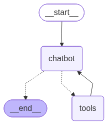

## Welcome to Week 4, Day 4

This is the start of an AWESOME project! Really simple and very effective.


```python
from typing import Annotated
from typing_extensions import TypedDict
from langgraph.graph import StateGraph, START
from langgraph.graph.message import add_messages
from dotenv import load_dotenv
from IPython.display import Image, display
import gradio as gr
from langgraph.prebuilt import ToolNode, tools_condition
import requests
import os
from langchain.agents import Tool

from langchain_openai import ChatOpenAI
from langgraph.checkpoint.memory import MemorySaver
```


```python
load_dotenv(override=True)
```


    True


### Asynchronous LangGraph

To run a tool:  
Sync: `tool.run(inputs)`  
Async: `await tool.arun(inputs)`

To invoke the graph:  
Sync: `graph.invoke(state)`  
Async: `await graph.ainvoke(state)`


```python
class State(TypedDict):
    
    messages: Annotated[list, add_messages]


graph_builder = StateGraph(State)
```


```python
pushover_token = os.getenv("PUSHOVER_TOKEN")
pushover_user = os.getenv("PUSHOVER_USER")
pushover_url = "https://api.pushover.net/1/messages.json"

def push(text: str):
    """Send a push notification to the user"""
    requests.post(pushover_url, data = {"token": pushover_token, "user": pushover_user, "message": text})

tool_push = Tool(
        name="send_push_notification",
        func=push,
        description="useful for when you want to send a push notification"
    )
```

### Next: Install Playwright

On Windows and MacOS:  
`playwright install`

On Linux:  
`playwright install —with-reps chromium`

Student Mariano R. mentioned that you might also need to do this in a cursor terminal:

`uv run playwright install chromium`


```python
!uv run playwright install chromium
```

    Downloading Chromium 136.0.7103.25 (playwright build v1169) from https://cdn.playwright.dev/dbazure/download/playwright/builds/chromium/1169/chromium-linux.zip
    167.7 MiB [                    ] 0% 0.0s167.7 MiB [                    ] 0% 114.5s167.7 MiB [                    ] 0% 159.2s167.7 MiB [                    ] 0% 507.2s167.7 MiB [                    ] 0% 431.5s167.7 MiB [                    ] 0% 405.3s167.7 MiB [                    ] 0% 376.5s167.7 MiB [                    ] 0% 508.0s167.7 MiB [                    ] 0% 471.6s167.7 MiB [                    ] 0% 447.5s167.7 MiB [                    ] 0% 419.1s167.7 MiB [                    ] 0% 406.0s167.7 MiB [                    ] 0% 384.7s167.7 MiB [                    ] 0% 419.7s167.7 MiB [                    ] 0% 401.3s167.7 MiB [                    ] 0% 391.4s167.7 MiB [                    ] 0% 376.8s167.7 MiB [                    ] 0% 363.6s167.7 MiB [                    ] 0% 345.3s167.7 MiB [                    ] 0% 333.2s167.7 MiB [                    ] 0% 322.8s167.7 MiB [                    ] 0% 309.7s167.7 MiB [                    ] 0% 301.3s167.7 MiB [                    ] 0% 292.7s167.7 MiB [                    ] 0% 280.6s167.7 MiB [                    ] 0% 268.6s167.7 MiB [                    ] 0% 257.8s167.7 MiB [                    ] 0% 248.3s167.7 MiB [                    ] 0% 239.8s167.7 MiB [                    ] 0% 232.1s167.7 MiB [                    ] 0% 224.7s167.7 MiB [                    ] 0% 217.7s167.7 MiB [                    ] 0% 211.3s167.7 MiB [                    ] 0% 205.2s167.7 MiB [                    ] 0% 197.8s167.7 MiB [                    ] 0% 189.8s167.7 MiB [                    ] 0% 182.4s167.7 MiB [                    ] 0% 174.8s167.7 MiB [                    ] 0% 166.2s167.7 MiB [                    ] 0% 158.4s167.7 MiB [                    ] 0% 152.9s167.7 MiB [                    ] 0% 146.4s167.7 MiB [                    ] 0% 141.2s167.7 MiB [                    ] 0% 135.9s167.7 MiB [                    ] 0% 131.1s167.7 MiB [                    ] 1% 126.6s167.7 MiB [                    ] 1% 122.1s167.7 MiB [                    ] 1% 117.5s167.7 MiB [                    ] 1% 113.3s167.7 MiB [                    ] 1% 116.5s167.7 MiB [                    ] 1% 110.6s167.7 MiB [                    ] 1% 104.9s167.7 MiB [                    ] 1% 99.9s167.7 MiB [                    ] 1% 95.1s167.7 MiB [                    ] 1% 90.4s167.7 MiB [                    ] 1% 85.9s167.7 MiB [                    ] 1% 108.8s167.7 MiB [                    ] 1% 100.5s167.7 MiB [                    ] 2% 93.5s167.7 MiB [                    ] 2% 87.1s167.7 MiB [                    ] 2% 82.1s167.7 MiB [=                   ] 2% 77.5s167.7 MiB [=                   ] 2% 73.7s167.7 MiB [=                   ] 2% 70.4s167.7 MiB [=                   ] 3% 67.1s167.7 MiB [=                   ] 3% 64.3s167.7 MiB [=                   ] 3% 61.6s167.7 MiB [=                   ] 3% 59.3s167.7 MiB [=                   ] 3% 63.0s167.7 MiB [=                   ] 3% 60.2s167.7 MiB [=                   ] 3% 58.4s167.7 MiB [=                   ] 4% 55.6s167.7 MiB [=                   ] 4% 55.7s167.7 MiB [=                   ] 4% 53.3s167.7 MiB [=                   ] 4% 51.1s167.7 MiB [=                   ] 4% 60.2s167.7 MiB [=                   ] 4% 57.7s167.7 MiB [=                   ] 5% 57.2s167.7 MiB [=                   ] 5% 55.2s167.7 MiB [=                   ] 5% 53.1s167.7 MiB [=                   ] 5% 51.4s167.7 MiB [=                   ] 5% 52.3s167.7 MiB [=                   ] 6% 50.6s167.7 MiB [=                   ] 6% 51.2s167.7 MiB [=                   ] 6% 49.6s167.7 MiB [=                   ] 6% 49.2s167.7 MiB [=                   ] 6% 48.1s167.7 MiB [=                   ] 6% 46.8s167.7 MiB [=                   ] 7% 49.3s167.7 MiB [=                   ] 7% 48.1s167.7 MiB [=                   ] 7% 48.7s167.7 MiB [==                  ] 7% 47.5s167.7 MiB [==                  ] 7% 53.6s167.7 MiB [==                  ] 7% 52.3s167.7 MiB [==                  ] 8% 51.1s167.7 MiB [==                  ] 8% 51.5s167.7 MiB [==                  ] 8% 50.4s167.7 MiB [==                  ] 8% 49.2s167.7 MiB [==                  ] 8% 48.3s167.7 MiB [==                  ] 9% 47.3s167.7 MiB [==                  ] 9% 46.1s167.7 MiB [==                  ] 9% 45.6s167.7 MiB [==                  ] 9% 44.7s167.7 MiB [==                  ] 9% 44.4s167.7 MiB [==                  ] 10% 43.5s167.7 MiB [==                  ] 10% 43.4s167.7 MiB [==                  ] 10% 43.1s167.7 MiB [==                  ] 10% 42.4s167.7 MiB [==                  ] 10% 41.9s167.7 MiB [==                  ] 10% 41.6s167.7 MiB [==                  ] 10% 40.8s167.7 MiB [==                  ] 11% 40.0s167.7 MiB [==                  ] 11% 39.3s167.7 MiB [==                  ] 11% 38.5s167.7 MiB [==                  ] 11% 37.7s167.7 MiB [==                  ] 12% 37.5s167.7 MiB [==                  ] 12% 37.2s167.7 MiB [==                  ] 12% 37.6s167.7 MiB [===                 ] 12% 36.7s167.7 MiB [===                 ] 12% 35.8s167.7 MiB [===                 ] 13% 35.1s167.7 MiB [===                 ] 13% 34.7s167.7 MiB [===                 ] 13% 34.2s167.7 MiB [===                 ] 14% 33.5s167.7 MiB [===                 ] 14% 33.0s167.7 MiB [===                 ] 14% 32.1s167.7 MiB [===                 ] 14% 32.3s167.7 MiB [===                 ] 14% 31.6s167.7 MiB [===                 ] 15% 30.8s167.7 MiB [===                 ] 15% 31.0s167.7 MiB [===                 ] 15% 30.4s167.7 MiB [===                 ] 15% 30.6s167.7 MiB [===                 ] 15% 30.4s167.7 MiB [===                 ] 16% 29.9s167.7 MiB [===                 ] 16% 29.3s167.7 MiB [===                 ] 16% 29.4s167.7 MiB [===                 ] 17% 28.8s167.7 MiB [===                 ] 17% 28.4s167.7 MiB [====                ] 17% 27.8s167.7 MiB [====                ] 17% 27.9s167.7 MiB [====                ] 18% 27.6s167.7 MiB [====                ] 18% 27.4s167.7 MiB [====                ] 18% 26.8s167.7 MiB [====                ] 19% 26.7s167.7 MiB [====                ] 19% 26.3s167.7 MiB [====                ] 19% 25.9s167.7 MiB [====                ] 20% 25.3s167.7 MiB [====                ] 20% 25.2s167.7 MiB [====                ] 20% 25.3s167.7 MiB [====                ] 20% 24.9s167.7 MiB [====                ] 20% 24.5s167.7 MiB [====                ] 20% 24.6s167.7 MiB [====                ] 21% 24.3s167.7 MiB [====                ] 21% 24.1s167.7 MiB [====                ] 21% 26.5s167.7 MiB [====                ] 21% 27.0s167.7 MiB [====                ] 22% 27.7s167.7 MiB [====                ] 22% 27.2s167.7 MiB [=====               ] 22% 27.0s167.7 MiB [=====               ] 22% 26.6s167.7 MiB [=====               ] 23% 26.3s167.7 MiB [=====               ] 23% 26.5s167.7 MiB [=====               ] 23% 26.0s167.7 MiB [=====               ] 23% 26.9s167.7 MiB [=====               ] 24% 28.1s167.7 MiB [=====               ] 24% 28.0s167.7 MiB [=====               ] 24% 34.5s167.7 MiB [=====               ] 25% 34.1s167.7 MiB [=====               ] 25% 33.6s167.7 MiB [=====               ] 25% 33.0s167.7 MiB [=====               ] 26% 32.4s167.7 MiB [=====               ] 26% 32.5s167.7 MiB [=====               ] 26% 32.1s167.7 MiB [=====               ] 26% 31.7s167.7 MiB [=====               ] 27% 31.4s167.7 MiB [=====               ] 27% 35.4s167.7 MiB [======              ] 27% 37.6s167.7 MiB [======              ] 28% 37.4s167.7 MiB [======              ] 28% 36.8s167.7 MiB [======              ] 28% 36.1s167.7 MiB [======              ] 28% 36.0s167.7 MiB [======              ] 29% 35.4s167.7 MiB [======              ] 29% 34.9s167.7 MiB [======              ] 29% 35.2s167.7 MiB [======              ] 30% 34.8s167.7 MiB [======              ] 30% 34.4s167.7 MiB [======              ] 30% 34.0s167.7 MiB [======              ] 31% 35.1s167.7 MiB [======              ] 31% 35.6s167.7 MiB [======              ] 31% 35.1s167.7 MiB [======              ] 32% 34.5s167.7 MiB [======              ] 32% 34.7s167.7 MiB [=======             ] 32% 34.3s167.7 MiB [=======             ] 32% 34.0s167.7 MiB [=======             ] 33% 33.6s167.7 MiB [=======             ] 33% 35.2s167.7 MiB [=======             ] 33% 35.0s167.7 MiB [=======             ] 34% 34.7s167.7 MiB [=======             ] 34% 34.1s167.7 MiB [=======             ] 34% 33.9s167.7 MiB [=======             ] 34% 33.5s167.7 MiB [=======             ] 35% 33.1s167.7 MiB [=======             ] 35% 32.6s167.7 MiB [=======             ] 35% 32.9s167.7 MiB [=======             ] 36% 32.6s167.7 MiB [=======             ] 36% 32.2s167.7 MiB [=======             ] 36% 32.1s167.7 MiB [=======             ] 36% 32.0s167.7 MiB [=======             ] 37% 31.6s167.7 MiB [========            ] 37% 31.2s167.7 MiB [========            ] 37% 30.8s167.7 MiB [========            ] 38% 30.6s167.7 MiB [========            ] 38% 30.2s167.7 MiB [========            ] 38% 29.9s167.7 MiB [========            ] 38% 29.8s167.7 MiB [========            ] 39% 29.5s167.7 MiB [========            ] 39% 29.4s167.7 MiB [========            ] 39% 29.5s167.7 MiB [========            ] 39% 29.2s167.7 MiB [========            ] 39% 28.9s167.7 MiB [========            ] 40% 28.5s167.7 MiB [========            ] 40% 28.6s167.7 MiB [========            ] 40% 28.3s167.7 MiB [========            ] 41% 28.1s167.7 MiB [========            ] 41% 27.6s167.7 MiB [========            ] 41% 27.7s167.7 MiB [========            ] 42% 28.0s167.7 MiB [========            ] 42% 27.8s167.7 MiB [=========           ] 42% 27.4s167.7 MiB [=========           ] 42% 27.2s167.7 MiB [=========           ] 43% 27.0s167.7 MiB [=========           ] 43% 26.9s167.7 MiB [=========           ] 43% 26.6s167.7 MiB [=========           ] 44% 26.5s167.7 MiB [=========           ] 44% 26.2s167.7 MiB [=========           ] 44% 26.0s167.7 MiB [=========           ] 45% 25.6s167.7 MiB [=========           ] 45% 25.5s167.7 MiB [=========           ] 45% 25.2s167.7 MiB [=========           ] 45% 24.9s167.7 MiB [=========           ] 46% 24.6s167.7 MiB [=========           ] 46% 24.5s167.7 MiB [=========           ] 46% 24.4s167.7 MiB [=========           ] 46% 24.2s167.7 MiB [=========           ] 47% 23.9s167.7 MiB [=========           ] 47% 23.7s167.7 MiB [==========          ] 47% 23.6s167.7 MiB [==========          ] 47% 23.5s167.7 MiB [==========          ] 48% 23.3s167.7 MiB [==========          ] 48% 23.1s167.7 MiB [==========          ] 48% 22.8s167.7 MiB [==========          ] 48% 23.3s167.7 MiB [==========          ] 49% 23.2s167.7 MiB [==========          ] 49% 23.1s167.7 MiB [==========          ] 49% 22.7s167.7 MiB [==========          ] 50% 22.9s167.7 MiB [==========          ] 50% 22.6s167.7 MiB [==========          ] 50% 22.3s167.7 MiB [==========          ] 51% 22.1s167.7 MiB [==========          ] 51% 21.9s167.7 MiB [==========          ] 51% 22.4s167.7 MiB [==========          ] 51% 22.3s167.7 MiB [==========          ] 51% 22.2s167.7 MiB [==========          ] 52% 21.9s167.7 MiB [==========          ] 52% 21.7s167.7 MiB [===========         ] 52% 21.5s167.7 MiB [===========         ] 53% 21.2s167.7 MiB [===========         ] 53% 20.9s167.7 MiB [===========         ] 53% 20.8s167.7 MiB [===========         ] 53% 20.6s167.7 MiB [===========         ] 54% 20.3s167.7 MiB [===========         ] 54% 20.2s167.7 MiB [===========         ] 54% 20.1s167.7 MiB [===========         ] 54% 20.0s167.7 MiB [===========         ] 55% 20.0s167.7 MiB [===========         ] 55% 19.8s167.7 MiB [===========         ] 55% 19.6s167.7 MiB [===========         ] 56% 19.7s167.7 MiB [===========         ] 56% 19.6s167.7 MiB [===========         ] 56% 19.4s167.7 MiB [===========         ] 57% 19.1s167.7 MiB [===========         ] 57% 19.0s167.7 MiB [============        ] 57% 18.9s167.7 MiB [============        ] 57% 18.7s167.7 MiB [============        ] 58% 18.4s167.7 MiB [============        ] 59% 18.3s167.7 MiB [============        ] 59% 18.0s167.7 MiB [============        ] 59% 17.9s167.7 MiB [============        ] 59% 17.7s167.7 MiB [============        ] 60% 17.5s167.7 MiB [============        ] 60% 17.3s167.7 MiB [============        ] 60% 17.1s167.7 MiB [============        ] 61% 16.9s167.7 MiB [============        ] 61% 16.7s167.7 MiB [============        ] 61% 16.5s167.7 MiB [============        ] 62% 16.4s167.7 MiB [============        ] 62% 16.2s167.7 MiB [=============       ] 62% 16.0s167.7 MiB [=============       ] 62% 15.8s167.7 MiB [=============       ] 63% 15.8s167.7 MiB [=============       ] 63% 15.7s167.7 MiB [=============       ] 63% 15.5s167.7 MiB [=============       ] 64% 15.3s167.7 MiB [=============       ] 64% 15.1s167.7 MiB [=============       ] 64% 15.0s167.7 MiB [=============       ] 65% 15.2s167.7 MiB [=============       ] 65% 14.9s167.7 MiB [=============       ] 65% 14.8s167.7 MiB [=============       ] 66% 14.6s167.7 MiB [=============       ] 66% 14.4s167.7 MiB [=============       ] 67% 14.2s167.7 MiB [=============       ] 67% 14.0s167.7 MiB [==============      ] 67% 13.8s167.7 MiB [==============      ] 67% 13.7s167.7 MiB [==============      ] 68% 13.6s167.7 MiB [==============      ] 68% 13.4s167.7 MiB [==============      ] 68% 13.2s167.7 MiB [==============      ] 69% 13.6s167.7 MiB [==============      ] 69% 13.5s167.7 MiB [==============      ] 69% 13.4s167.7 MiB [==============      ] 70% 13.2s167.7 MiB [==============      ] 70% 13.1s167.7 MiB [==============      ] 70% 12.9s167.7 MiB [==============      ] 70% 12.8s167.7 MiB [==============      ] 71% 12.6s167.7 MiB [==============      ] 71% 12.4s167.7 MiB [==============      ] 72% 12.2s167.7 MiB [===============     ] 72% 12.0s167.7 MiB [===============     ] 73% 11.8s167.7 MiB [===============     ] 73% 11.7s167.7 MiB [===============     ] 73% 11.5s167.7 MiB [===============     ] 73% 11.4s167.7 MiB [===============     ] 74% 11.3s167.7 MiB [===============     ] 74% 11.1s167.7 MiB [===============     ] 74% 10.9s167.7 MiB [===============     ] 75% 10.8s167.7 MiB [===============     ] 75% 10.6s167.7 MiB [===============     ] 75% 10.5s167.7 MiB [===============     ] 76% 10.2s167.7 MiB [===============     ] 76% 10.1s167.7 MiB [===============     ] 76% 9.9s167.7 MiB [===============     ] 77% 9.8s167.7 MiB [================    ] 77% 9.7s167.7 MiB [================    ] 77% 9.6s167.7 MiB [================    ] 78% 9.4s167.7 MiB [================    ] 78% 9.3s167.7 MiB [================    ] 79% 9.1s167.7 MiB [================    ] 79% 9.0s167.7 MiB [================    ] 79% 8.8s167.7 MiB [================    ] 79% 8.7s167.7 MiB [================    ] 80% 8.6s167.7 MiB [================    ] 80% 8.5s167.7 MiB [================    ] 80% 8.3s167.7 MiB [================    ] 81% 8.2s167.7 MiB [================    ] 81% 8.0s167.7 MiB [================    ] 81% 7.9s167.7 MiB [================    ] 82% 7.7s167.7 MiB [================    ] 82% 7.6s167.7 MiB [=================   ] 82% 7.5s167.7 MiB [=================   ] 82% 7.3s167.7 MiB [=================   ] 83% 7.1s167.7 MiB [=================   ] 83% 7.0s167.7 MiB [=================   ] 83% 6.9s167.7 MiB [=================   ] 84% 6.8s167.7 MiB [=================   ] 84% 6.6s167.7 MiB [=================   ] 84% 6.5s167.7 MiB [=================   ] 84% 6.6s167.7 MiB [=================   ] 84% 6.4s167.7 MiB [=================   ] 85% 6.3s167.7 MiB [=================   ] 85% 6.1s167.7 MiB [=================   ] 85% 6.0s167.7 MiB [=================   ] 86% 5.9s167.7 MiB [=================   ] 86% 5.7s167.7 MiB [=================   ] 86% 5.5s167.7 MiB [=================   ] 87% 5.5s167.7 MiB [=================   ] 87% 5.4s167.7 MiB [==================  ] 87% 5.2s167.7 MiB [==================  ] 88% 5.0s167.7 MiB [==================  ] 88% 4.8s167.7 MiB [==================  ] 88% 4.7s167.7 MiB [==================  ] 89% 4.5s167.7 MiB [==================  ] 89% 4.4s167.7 MiB [==================  ] 89% 4.3s167.7 MiB [==================  ] 90% 4.2s167.7 MiB [==================  ] 90% 4.0s167.7 MiB [==================  ] 90% 3.9s167.7 MiB [==================  ] 90% 3.8s167.7 MiB [==================  ] 91% 3.7s167.7 MiB [==================  ] 91% 3.5s167.7 MiB [==================  ] 91% 3.4s167.7 MiB [==================  ] 92% 3.3s167.7 MiB [=================== ] 92% 3.1s167.7 MiB [=================== ] 92% 3.0s167.7 MiB [=================== ] 93% 2.9s167.7 MiB [=================== ] 93% 2.8s167.7 MiB [=================== ] 93% 2.7s167.7 MiB [=================== ] 94% 2.5s167.7 MiB [=================== ] 94% 2.4s167.7 MiB [=================== ] 94% 2.3s167.7 MiB [=================== ] 94% 2.2s167.7 MiB [=================== ] 95% 2.0s167.7 MiB [=================== ] 95% 1.9s167.7 MiB [=================== ] 95% 1.8s167.7 MiB [=================== ] 96% 1.7s167.7 MiB [=================== ] 96% 1.5s167.7 MiB [=================== ] 96% 1.4s167.7 MiB [=================== ] 96% 1.3s167.7 MiB [=================== ] 97% 1.2s167.7 MiB [====================] 97% 1.0s167.7 MiB [====================] 97% 0.9s167.7 MiB [====================] 98% 0.8s167.7 MiB [====================] 98% 0.7s167.7 MiB [====================] 98% 0.5s167.7 MiB [====================] 99% 0.4s167.7 MiB [====================] 99% 0.3s167.7 MiB [====================] 99% 0.2s167.7 MiB [====================] 100% 0.0s
    Chromium 136.0.7103.25 (playwright build v1169) downloaded to /home/joe/.cache/ms-playwright/chromium-1169
    Downloading Chromium Headless Shell 136.0.7103.25 (playwright build v1169) from https://cdn.playwright.dev/dbazure/download/playwright/builds/chromium/1169/chromium-headless-shell-linux.zip
    101.4 MiB [                    ] 0% 0.0s101.4 MiB [                    ] 0% 162.9s101.4 MiB [                    ] 0% 218.4s101.4 MiB [                    ] 0% 241.6s101.4 MiB [                    ] 0% 249.4s101.4 MiB [                    ] 0% 626.1s101.4 MiB [                    ] 0% 554.7s101.4 MiB [                    ] 0% 500.3s101.4 MiB [                    ] 0% 420.1s101.4 MiB [                    ] 0% 370.8s101.4 MiB [                    ] 0% 406.6s101.4 MiB [                    ] 0% 372.9s101.4 MiB [                    ] 0% 344.8s101.4 MiB [                    ] 0% 322.1s101.4 MiB [                    ] 0% 284.7s101.4 MiB [                    ] 0% 256.1s101.4 MiB [                    ] 0% 276.1s101.4 MiB [                    ] 0% 252.7s101.4 MiB [                    ] 0% 233.6s101.4 MiB [                    ] 0% 217.2s101.4 MiB [                    ] 0% 202.8s101.4 MiB [                    ] 0% 190.9s101.4 MiB [                    ] 0% 175.3s101.4 MiB [                    ] 0% 162.4s101.4 MiB [                    ] 0% 172.5s101.4 MiB [                    ] 0% 160.8s101.4 MiB [                    ] 0% 150.7s101.4 MiB [                    ] 0% 142.2s101.4 MiB [                    ] 0% 132.5s101.4 MiB [                    ] 0% 123.7s101.4 MiB [                    ] 0% 114.3s101.4 MiB [                    ] 0% 110.1s101.4 MiB [                    ] 0% 102.8s101.4 MiB [                    ] 1% 104.2s101.4 MiB [                    ] 1% 96.9s101.4 MiB [                    ] 1% 90.7s101.4 MiB [                    ] 1% 85.4s101.4 MiB [                    ] 1% 80.7s101.4 MiB [                    ] 1% 75.2s101.4 MiB [                    ] 1% 70.4s101.4 MiB [                    ] 1% 66.9s101.4 MiB [                    ] 1% 63.2s101.4 MiB [                    ] 2% 58.7s101.4 MiB [                    ] 2% 60.5s101.4 MiB [                    ] 2% 57.4s101.4 MiB [                    ] 2% 53.2s101.4 MiB [=                   ] 2% 49.9s101.4 MiB [=                   ] 2% 46.8s101.4 MiB [=                   ] 3% 43.9s101.4 MiB [=                   ] 3% 41.2s101.4 MiB [=                   ] 3% 38.4s101.4 MiB [=                   ] 3% 36.4s101.4 MiB [=                   ] 4% 33.9s101.4 MiB [=                   ] 4% 33.4s101.4 MiB [=                   ] 4% 34.3s101.4 MiB [=                   ] 4% 32.5s101.4 MiB [=                   ] 4% 30.4s101.4 MiB [=                   ] 5% 28.3s101.4 MiB [=                   ] 5% 26.3s101.4 MiB [=                   ] 6% 24.4s101.4 MiB [=                   ] 6% 23.3s101.4 MiB [=                   ] 6% 22.6s101.4 MiB [=                   ] 6% 22.0s101.4 MiB [=                   ] 7% 21.2s101.4 MiB [=                   ] 7% 21.7s101.4 MiB [==                  ] 7% 21.3s101.4 MiB [==                  ] 7% 20.7s101.4 MiB [==                  ] 8% 19.6s101.4 MiB [==                  ] 8% 18.9s101.4 MiB [==                  ] 9% 17.9s101.4 MiB [==                  ] 9% 17.3s101.4 MiB [==                  ] 9% 17.0s101.4 MiB [==                  ] 9% 16.6s101.4 MiB [==                  ] 10% 16.2s101.4 MiB [==                  ] 10% 16.5s101.4 MiB [==                  ] 10% 16.3s101.4 MiB [==                  ] 10% 16.1s101.4 MiB [==                  ] 11% 15.4s101.4 MiB [==                  ] 11% 15.1s101.4 MiB [==                  ] 12% 14.6s101.4 MiB [===                 ] 12% 14.1s101.4 MiB [===                 ] 12% 13.9s101.4 MiB [===                 ] 13% 13.7s101.4 MiB [===                 ] 13% 13.6s101.4 MiB [===                 ] 13% 13.4s101.4 MiB [===                 ] 13% 13.6s101.4 MiB [===                 ] 13% 13.4s101.4 MiB [===                 ] 14% 13.1s101.4 MiB [===                 ] 14% 12.8s101.4 MiB [===                 ] 14% 12.7s101.4 MiB [===                 ] 15% 12.5s101.4 MiB [===                 ] 15% 11.9s101.4 MiB [===                 ] 16% 11.8s101.4 MiB [===                 ] 16% 11.7s101.4 MiB [===                 ] 16% 11.6s101.4 MiB [===                 ] 16% 11.7s101.4 MiB [===                 ] 17% 11.6s101.4 MiB [===                 ] 17% 11.5s101.4 MiB [====                ] 17% 11.2s101.4 MiB [====                ] 18% 11.1s101.4 MiB [====                ] 18% 11.0s101.4 MiB [====                ] 18% 10.8s101.4 MiB [====                ] 19% 10.5s101.4 MiB [====                ] 19% 10.4s101.4 MiB [====                ] 19% 10.2s101.4 MiB [====                ] 19% 10.4s101.4 MiB [====                ] 20% 10.3s101.4 MiB [====                ] 20% 10.2s101.4 MiB [====                ] 20% 10.0s101.4 MiB [====                ] 21% 9.9s101.4 MiB [====                ] 21% 9.8s101.4 MiB [====                ] 21% 9.7s101.4 MiB [====                ] 22% 9.5s101.4 MiB [=====               ] 22% 9.3s101.4 MiB [=====               ] 22% 9.2s101.4 MiB [=====               ] 22% 9.4s101.4 MiB [=====               ] 23% 9.4s101.4 MiB [=====               ] 23% 9.3s101.4 MiB [=====               ] 23% 9.2s101.4 MiB [=====               ] 24% 9.0s101.4 MiB [=====               ] 24% 8.9s101.4 MiB [=====               ] 24% 8.8s101.4 MiB [=====               ] 25% 8.6s101.4 MiB [=====               ] 25% 8.5s101.4 MiB [=====               ] 26% 8.4s101.4 MiB [=====               ] 26% 8.5s101.4 MiB [=====               ] 26% 8.4s101.4 MiB [=====               ] 26% 8.3s101.4 MiB [=====               ] 27% 8.2s101.4 MiB [======              ] 27% 8.1s101.4 MiB [======              ] 27% 8.0s101.4 MiB [======              ] 28% 8.0s101.4 MiB [======              ] 28% 7.9s101.4 MiB [======              ] 29% 7.7s101.4 MiB [======              ] 29% 7.8s101.4 MiB [======              ] 29% 7.7s101.4 MiB [======              ] 30% 7.6s101.4 MiB [======              ] 30% 7.5s101.4 MiB [======              ] 31% 7.4s101.4 MiB [======              ] 31% 7.3s101.4 MiB [======              ] 31% 7.2s101.4 MiB [======              ] 32% 7.1s101.4 MiB [======              ] 32% 7.2s101.4 MiB [=======             ] 32% 7.2s101.4 MiB [=======             ] 32% 7.1s101.4 MiB [=======             ] 33% 7.0s101.4 MiB [=======             ] 34% 6.9s101.4 MiB [=======             ] 34% 6.8s101.4 MiB [=======             ] 34% 6.7s101.4 MiB [=======             ] 35% 6.7s101.4 MiB [=======             ] 35% 6.6s101.4 MiB [=======             ] 36% 6.5s101.4 MiB [=======             ] 36% 6.4s101.4 MiB [=======             ] 37% 6.4s101.4 MiB [========            ] 37% 6.3s101.4 MiB [========            ] 37% 6.2s101.4 MiB [========            ] 38% 6.2s101.4 MiB [========            ] 38% 6.1s101.4 MiB [========            ] 39% 6.1s101.4 MiB [========            ] 39% 6.0s101.4 MiB [========            ] 39% 5.9s101.4 MiB [========            ] 40% 5.9s101.4 MiB [========            ] 40% 5.8s101.4 MiB [========            ] 41% 5.7s101.4 MiB [========            ] 42% 5.7s101.4 MiB [=========           ] 42% 5.6s101.4 MiB [=========           ] 42% 5.5s101.4 MiB [=========           ] 43% 5.5s101.4 MiB [=========           ] 43% 5.4s101.4 MiB [=========           ] 44% 5.3s101.4 MiB [=========           ] 45% 5.3s101.4 MiB [=========           ] 45% 5.2s101.4 MiB [=========           ] 46% 5.1s101.4 MiB [=========           ] 46% 5.0s101.4 MiB [=========           ] 47% 5.0s101.4 MiB [=========           ] 47% 4.9s101.4 MiB [==========          ] 47% 4.9s101.4 MiB [==========          ] 48% 4.9s101.4 MiB [==========          ] 48% 4.8s101.4 MiB [==========          ] 49% 4.8s101.4 MiB [==========          ] 49% 4.7s101.4 MiB [==========          ] 50% 4.6s101.4 MiB [==========          ] 50% 4.5s101.4 MiB [==========          ] 51% 4.5s101.4 MiB [==========          ] 52% 4.4s101.4 MiB [===========         ] 52% 4.3s101.4 MiB [===========         ] 53% 4.3s101.4 MiB [===========         ] 53% 4.2s101.4 MiB [===========         ] 54% 4.2s101.4 MiB [===========         ] 54% 4.1s101.4 MiB [===========         ] 55% 4.1s101.4 MiB [===========         ] 55% 4.0s101.4 MiB [===========         ] 56% 4.0s101.4 MiB [===========         ] 56% 3.9s101.4 MiB [===========         ] 57% 3.9s101.4 MiB [===========         ] 57% 3.8s101.4 MiB [============        ] 57% 3.8s101.4 MiB [============        ] 58% 3.8s101.4 MiB [============        ] 58% 3.7s101.4 MiB [============        ] 59% 3.6s101.4 MiB [============        ] 60% 3.5s101.4 MiB [============        ] 61% 3.5s101.4 MiB [============        ] 61% 3.4s101.4 MiB [============        ] 62% 3.4s101.4 MiB [============        ] 62% 3.3s101.4 MiB [=============       ] 62% 3.3s101.4 MiB [=============       ] 63% 3.2s101.4 MiB [=============       ] 64% 3.2s101.4 MiB [=============       ] 64% 3.1s101.4 MiB [=============       ] 65% 3.1s101.4 MiB [=============       ] 65% 3.0s101.4 MiB [=============       ] 66% 3.0s101.4 MiB [=============       ] 66% 2.9s101.4 MiB [=============       ] 67% 2.9s101.4 MiB [=============       ] 67% 2.8s101.4 MiB [==============      ] 67% 2.8s101.4 MiB [==============      ] 68% 2.8s101.4 MiB [==============      ] 68% 2.7s101.4 MiB [==============      ] 69% 2.6s101.4 MiB [==============      ] 70% 2.6s101.4 MiB [==============      ] 70% 2.5s101.4 MiB [==============      ] 71% 2.5s101.4 MiB [==============      ] 71% 2.4s101.4 MiB [==============      ] 72% 2.4s101.4 MiB [===============     ] 72% 2.3s101.4 MiB [===============     ] 73% 2.3s101.4 MiB [===============     ] 74% 2.2s101.4 MiB [===============     ] 74% 2.1s101.4 MiB [===============     ] 75% 2.1s101.4 MiB [===============     ] 75% 2.0s101.4 MiB [===============     ] 76% 2.0s101.4 MiB [===============     ] 77% 1.9s101.4 MiB [================    ] 77% 1.9s101.4 MiB [================    ] 78% 1.8s101.4 MiB [================    ] 79% 1.8s101.4 MiB [================    ] 79% 1.7s101.4 MiB [================    ] 80% 1.7s101.4 MiB [================    ] 80% 1.6s101.4 MiB [================    ] 81% 1.6s101.4 MiB [================    ] 81% 1.5s101.4 MiB [================    ] 82% 1.5s101.4 MiB [=================   ] 82% 1.5s101.4 MiB [=================   ] 82% 1.4s101.4 MiB [=================   ] 83% 1.4s101.4 MiB [=================   ] 84% 1.3s101.4 MiB [=================   ] 85% 1.2s101.4 MiB [=================   ] 86% 1.2s101.4 MiB [=================   ] 86% 1.1s101.4 MiB [=================   ] 87% 1.1s101.4 MiB [==================  ] 87% 1.0s101.4 MiB [==================  ] 88% 1.0s101.4 MiB [==================  ] 88% 0.9s101.4 MiB [==================  ] 89% 0.9s101.4 MiB [==================  ] 89% 0.8s101.4 MiB [==================  ] 90% 0.8s101.4 MiB [==================  ] 91% 0.7s101.4 MiB [==================  ] 92% 0.7s101.4 MiB [==================  ] 92% 0.6s101.4 MiB [=================== ] 92% 0.6s101.4 MiB [=================== ] 93% 0.6s101.4 MiB [=================== ] 93% 0.5s101.4 MiB [=================== ] 94% 0.5s101.4 MiB [=================== ] 94% 0.4s101.4 MiB [=================== ] 95% 0.4s101.4 MiB [=================== ] 95% 0.3s101.4 MiB [=================== ] 96% 0.3s101.4 MiB [=================== ] 97% 0.2s101.4 MiB [====================] 97% 0.2s101.4 MiB [====================] 98% 0.2s101.4 MiB [====================] 98% 0.1s101.4 MiB [====================] 99% 0.1s101.4 MiB [====================] 99% 0.0s101.4 MiB [====================] 100% 0.0s
    Chromium Headless Shell 136.0.7103.25 (playwright build v1169) downloaded to /home/joe/.cache/ms-playwright/chromium_headless_shell-1169


```python
# !playwright install
```

## And now - after Installing Playwright, a heads up for Windows PC Users:

While executing the next few cells, you might hit a problem with the Playwright browser raising a NotImplementedError.

This should work when we move to python modules, but it can cause problems in Windows in a notebook.

If you it this error and would like to run the notebook, you need to make a small change which seems quite hacky! You need to do this AFTER installing Playwright (prior cells)

1. Right click in `.venv` in the File Explorer on the left and select "Find in folder"
2. Search for `asyncio.set_event_loop_policy(WindowsSelectorEventLoopPolicy())`  
3. That code should be found in a line of code in a file called `kernelapp.py`
4. Comment out the entire else clause that this line is a part of - see the fragment below. Be sure to have the "pass" statement after the ImportError line.
5. Restart the kernel by pressing the "Restart" button above

```python
        if sys.platform.startswith("win") and sys.version_info >= (3, 8):
            import asyncio
 
            try:
                from asyncio import WindowsProactorEventLoopPolicy, WindowsSelectorEventLoopPolicy
            except ImportError:
                pass
                # not affected
           # else:
            #    if type(asyncio.get_event_loop_policy()) is WindowsProactorEventLoopPolicy:
                    # WindowsProactorEventLoopPolicy is not compatible with tornado 6
                    # fallback to the pre-3.8 default of Selector
                    # asyncio.set_event_loop_policy(WindowsSelectorEventLoopPolicy())
```

Thank you to student Nicolas for finding this, and to Kalyan, Yaki, Zibin and Bhaskar for confirming that this worked for them! And to Vladislav for the extra pointers.

As an alternative, you can just move to a Python module (which we do anyway in Day 5)


```python
# Introducing nest_asyncio
# Python async code only allows for one "event loop" processing aynchronous events.
# The `nest_asyncio` library patches this, and is used for special situations, if you need to run a nested event loop.

import nest_asyncio
nest_asyncio.apply()
```

### The LangChain community

One of the remarkable things about LangChain is the rich community around it.

Check this out:


```python
from langchain_community.agent_toolkits import PlayWrightBrowserToolkit
from langchain_community.tools.playwright.utils import create_async_playwright_browser
```


```python
# If you get a NotImplementedError here or later, see the Heads Up at the top of the notebook

# async_browser =  create_async_playwright_browser(headless=False)  # headful mode
async_browser =  create_async_playwright_browser(headless=True)  # headful mode

toolkit = PlayWrightBrowserToolkit.from_browser(async_browser=async_browser)
tools = toolkit.get_tools()
```


```python
for tool in tools:
    print(f"{tool.name}={tool}")
```

    click_element=async_browser=<Browser type=<BrowserType name=chromium executable_path=/home/joe/.cache/ms-playwright/chromium-1169/chrome-linux/chrome> version=136.0.7103.25>
    navigate_browser=async_browser=<Browser type=<BrowserType name=chromium executable_path=/home/joe/.cache/ms-playwright/chromium-1169/chrome-linux/chrome> version=136.0.7103.25>
    previous_webpage=async_browser=<Browser type=<BrowserType name=chromium executable_path=/home/joe/.cache/ms-playwright/chromium-1169/chrome-linux/chrome> version=136.0.7103.25>
    extract_text=async_browser=<Browser type=<BrowserType name=chromium executable_path=/home/joe/.cache/ms-playwright/chromium-1169/chrome-linux/chrome> version=136.0.7103.25>
    extract_hyperlinks=async_browser=<Browser type=<BrowserType name=chromium executable_path=/home/joe/.cache/ms-playwright/chromium-1169/chrome-linux/chrome> version=136.0.7103.25>
    get_elements=async_browser=<Browser type=<BrowserType name=chromium executable_path=/home/joe/.cache/ms-playwright/chromium-1169/chrome-linux/chrome> version=136.0.7103.25>
    current_webpage=async_browser=<Browser type=<BrowserType name=chromium executable_path=/home/joe/.cache/ms-playwright/chromium-1169/chrome-linux/chrome> version=136.0.7103.25>


```python
tool_dict = {tool.name:tool for tool in tools}

navigate_tool = tool_dict.get("navigate_browser")
extract_text_tool = tool_dict.get("extract_text")

    
await navigate_tool.arun({"url": "https://www.cnn.com"})
text = await extract_text_tool.arun({})
```


```python
import textwrap
print(textwrap.fill(text))
```

    Unknown Error


```python
all_tools = tools + [tool_push]
```


```python

llm = ChatOpenAI(model="gpt-4o-mini")
llm_with_tools = llm.bind_tools(all_tools)


def chatbot(state: State):
    return {"messages": [llm_with_tools.invoke(state["messages"])]}

```


```python

graph_builder = StateGraph(State)
graph_builder.add_node("chatbot", chatbot)
graph_builder.add_node("tools", ToolNode(tools=all_tools))
graph_builder.add_conditional_edges( "chatbot", tools_condition, "tools")
graph_builder.add_edge("tools", "chatbot")
graph_builder.add_edge(START, "chatbot")

memory = MemorySaver()
graph = graph_builder.compile(checkpointer=memory)
display(Image(graph.get_graph().draw_mermaid_png()))
```


    

    


```python
config = {"configurable": {"thread_id": "10"}}

async def chat(user_input: str, history):
    result = await graph.ainvoke({"messages": [{"role": "user", "content": user_input}]}, config=config)
    return result["messages"][-1].content


gr.ChatInterface(chat, type="messages").launch()
```

    * Running on local URL:  http://127.0.0.1:7860
    * To create a public link, set `share=True` in `launch()`.


<div><iframe src="http://127.0.0.1:7860/" width="100%" height="500" allow="autoplay; camera; microphone; clipboard-read; clipboard-write;" frameborder="0" allowfullscreen></iframe></div>


    


```python

```
